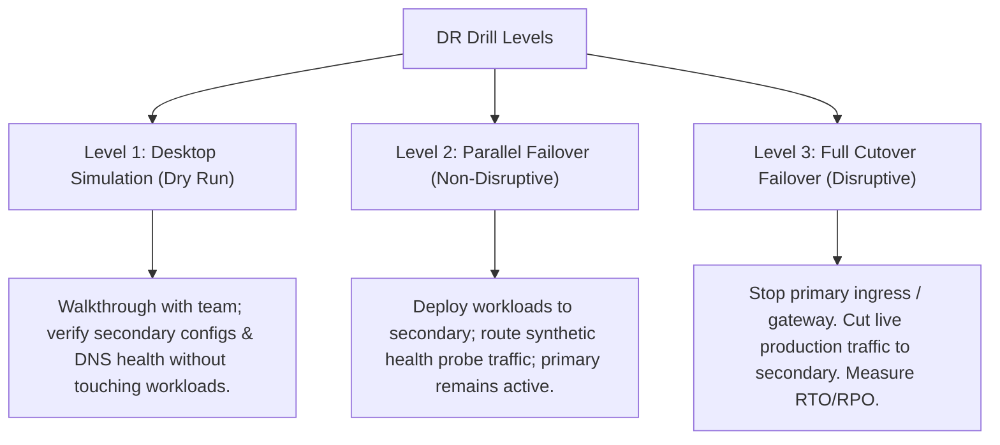

# 🌪️ Disaster Recovery (DR) Drill & Test Cases
### Enterprise Operational Resiliency & Business Continuity Runbook

This document defines the official Disaster Recovery (DR) drills, test cases, and execution runbooks for the enterprise AKS landing zone platform. It guarantees that the platform meets the target **Recovery Time Objective (RTO)** and **Recovery Point Objective (RPO)** constraints across all regional failure modes.

---

## 🎯 DR Objectives and Target SLA

The platform architecture implements geo-redundant storage (GRS), geo-replicated container registries (ACR), secondary regional Key Vault instances, and dual-region AKS deployments managed via GitOps (ArgoCD) and routed globally by Azure Front Door.

| Operational Tier | Metric | Target SLA | Business Justification |
| :--- | :--- | :---: | :--- |
| **Global Routing** | Failover Detection & Routing | **< 60 seconds** | Automates traffic shifts at DNS/CDN layer without user disruption. |
| **Compute & Workloads** | AKS Cluster Recovery (GitOps Replay) | **< 10 minutes** | Rebuilds container state in secondary cluster from git source of truth. |
| **Secrets & Keys** | Key Vault Secondary Availability | **< 30 seconds** | Maintains application access to databases and external APIs. |
| **Persistent Data** | Velero Cross-Region Backup Restore | **< 15 minutes** | Restores stateful PVCs and configuration backups from GRS replicas. |
| **Image Registry** | ACR Geo-Replication Switchover | **< 60 seconds** | Secondary node pools pull images from local regional registry replicas. |

---

## 🏗️ DR Drill Classifications

We categorize drills into three levels of testing intensity to avoid unnecessary disruption to dev/qa pipelines:



---

## 📋 Operational DR Test Cases

---

### 🧪 DR-TC-01: Ingress Route Failover (Azure Front Door Routing)
**Target Component:** Azure Front Door & Primary Application Gateway (`appgw-platform-dev-eus`)  
**Objective:** Verify that Front Door detects a primary regional outage and redirects traffic automatically.  
**Intensity Level:** Level 3 (Disruptive to primary regional path, non-disruptive globally)

#### 📝 Pre-requisites
* User traffic is running against the global hostname: `https://endpoint-customer-api-dev.azurefd.net`
* Secondary region ingress gateway is configured and healthy.

#### 🛠️ Execution Steps
1. Open a terminal on your workstation and start a loop monitoring the endpoint:
   ```powershell
   while ($true) {
       $start = Get-Date
       try {
           $res = Invoke-RestMethod -Uri "https://endpoint-customer-api-dev.azurefd.net/healthz" -TimeoutSec 3
           $latency = (New-TimeSpan -Start $start -End (Get-Date)).TotalMilliseconds
           Write-Host "$(Get-Date -Format 'HH:mm:ss') - Active Region: $($res.region) | Code: 200 | Latency: $($latency)ms" -ForegroundColor Green
       } catch {
           Write-Host "$(Get-Date -Format 'HH:mm:ss') - Endpoint Unreachable: $_" -ForegroundColor Red
       }
       Start-Sleep -Seconds 2
   }
   ```
2. In the Azure Portal, navigate to **Application Gateways** ➔ select primary **`appgw-platform-dev-eus`**.
3. In the top toolbar, click **Stop** to simulate a regional ingress outage.
4. Observe the PowerShell terminal. Record the timestamp when errors start and when traffic shifts.
5. In the Azure Portal, go to **Front Door manager** ➔ **Origin Groups** ➔ check origin health states.

#### 🏁 Expected Success Criteria
* Traffic routes successfully to the secondary West US origin (`origin-appgw-wus`) within **60 seconds**.
* Minimal packet loss during transition (no more than 3 failed loop requests).
* Health probe graphs in Front Door display primary origin status as **Unhealthy** and secondary as **Healthy**.

---

### 🧪 DR-TC-02: AKS Compute Failure & GitOps Recovery
**Target Component:** Primary AKS Cluster (`aks-dev-cluster`) & ArgoCD GitOps  
**Objective:** Verify application deployment and state recovery on the secondary AKS cluster using git manifests.  
**Intensity Level:** Level 2 (Non-disruptive) or Level 3 (Disruptive)

#### 📝 Pre-requisites
* Secondary AKS cluster (`aks-dev-wus-cluster`) is provisioned and registered in Azure DevOps.
* The `platform-gitops` repository is configured with regional app folder overlays (`/envs/dev-wus/`).

#### 🛠️ Execution Steps
1. Simulate cluster loss by pointing your active shell to the secondary cluster context:
   ```powershell
   az aks get-credentials --resource-group rg-platform-dev-wus --name aks-dev-wus-cluster --overwrite-existing
   ```
2. Log in to the ArgoCD dashboard configured for the secondary cluster.
3. Check the root application `dev-wus-apps` status.
4. If the application configuration has drifted or is not synchronized, manually trigger reconciliation:
   ```bash
   argocd app sync dev-wus-apps --recursive
   ```
5. Monitor pod creation and verify readiness in namespaces `dev`, `monitoring`, `security`:
   ```bash
   kubectl get pods -n dev
   kubectl get ingress -n dev
   ```

#### 🏁 Expected Success Criteria
* ArgoCD synchronizes all microservices and infra tools (Kyverno, Prometheus/Grafana, Istio) without manifest errors.
* Pods reach `Running` state within **5 minutes** of sync initiation.
* Secondary Application Gateway Ingress Controller (AGIC) automatically configures backend pools mapping to the secondary pods.

---

### 🧪 DR-TC-03: Key Vault Geo-Redundancy & Secrets Recovery
**Target Component:** Azure Key Vault (`kv-platform-dev-eus` / `kv-platform-dev-wus`)  
**Objective:** Verify secondary applications can resolve secrets from the geo-replicated/secondary Key Vault.  
**Intensity Level:** Level 1 (Desktop Simulation) or Level 2 (Parallel)

#### 📝 Pre-requisites
* Key Vault geo-redundancy (GRS) is enabled or secondary regional key vault is deployed.
* Entra ID federated workload identity credential is maps to `customer-api-sa` service account on the secondary cluster.

#### 🛠️ Execution Steps
1. Validate that the secrets in the primary Key Vault have replicated or are set up on the secondary:
   ```powershell
   az keyvault secret list --vault-name kv-platform-dev-wus --query "[].name"
   ```
2. Verify the secondary SecretProviderClass manifest references the correct secondary vault name `kv-platform-dev-wus`:
   ```yaml
   apiVersion: secrets-store.csi.x-k8s.io/v1
   kind: SecretProviderClass
   metadata:
     name: wus-kv-provider
     namespace: dev
   spec:
     provider: azure
     parameters:
       keyvaultName: "kv-platform-dev-wus"
       # ...
   ```
3. Deploy the test secret mounting pod on the secondary cluster.
4. Verify the secret mount filesystem inside the container:
   ```bash
   kubectl exec e2e-secret-pod -n dev -- cat /mnt/secrets/prod-db-password
   ```

#### 🏁 Expected Success Criteria
* Secrets are retrieved successfully from `kv-platform-dev-wus` within **30 seconds** of pod initialization.
* Workload identity matches federated client ID, and authorization permissions (`Get` / `List`) are inherited correctly on the secondary Key Vault.

---

### 🧪 DR-TC-04: Cross-Region Stateful Backup & Restore (Velero)
**Target Component:** Velero Backup & Storage GRS (`savelerodeveus` / `savelerodevwus`)  
**Objective:** Restore stateful PVC databases or application configurations from the primary region storage blob backup GRS replicas into the secondary cluster.  
**Intensity Level:** Level 2 (Non-disruptive)

#### 📝 Pre-requisites
* Velero CLI is installed on the admin workstation.
* Secondary storage account replication state is **Healthy** (read-access geo-redundant storage - RA-GRS).

#### 🛠️ Execution Steps
1. Assert GRS secondary region endpoint status:
   ```powershell
   az storage account show --name savelerodeveus --resource-group rg-platform-dev-eus --query "failoverInProgress"
   ```
2. Point the secondary Velero configuration to read from the replicated backup bucket container on the secondary storage account:
   ```bash
   velero backup-location set default --bucket velero --url https://savelerodeveus-secondary.blob.core.windows.net
   ```
3. Query the available backup snapshots list from the secondary cluster context:
   ```bash
   velero backup get
   ```
4. Restore the latest daily backup snapshot into the secondary cluster:
   ```bash
   velero restore create restore-drill-$(date +%F) --from-backup daily-backup-latest --include-namespaces dev
   ```
5. Monitor restore status:
   ```bash
   velero restore describe restore-drill-$(date +%F)
   ```

#### 🏁 Expected Success Criteria
* Velero identifies and accesses GRS storage backups without credential failures.
* Restored applications and associated Persistent Volume Claims (PVCs) recover successfully with data integrity preserved.
* Total recovery time (RTO) for stateful restore is **< 15 minutes**.

---

### 🧪 DR-TC-05: ACR Geo-Replication Pull Failover
**Target Component:** Azure Container Registry (`acrplatformdeveus`)  
**Objective:** Verify cluster nodes in the secondary region pull container images from the local geo-replicated ACR endpoint during a primary region network partition.  
**Intensity Level:** Level 2 (Non-disruptive)

#### 📝 Pre-requisites
* ACR geo-replication is active between East US (Primary) and West US (Secondary).
* Secondary AKS node pool has ACR pull access (`AcrPull` role assignment configured).

#### 🛠️ Execution Steps
1. Verify the replication registry endpoints:
   ```powershell
   az acr replication list --registry acrplatformdeveus --query "[].{Region:location, Status:status}"
   ```
2. Force a simulated network boundary by scheduling a pod on the secondary West US cluster using the global ACR image namespace:
   ```bash
   kubectl run acr-pull-test --image=acrplatformdeveus.azurecr.io/customer-api:1.0.0 -n dev --restart=Never
   ```
3. Watch the pod event logs during initialization:
   ```bash
   kubectl describe pod acr-pull-test -n dev
   ```

#### 🏁 Expected Success Criteria
* Nodes pull the image successfully without pulling timeouts or image download blocks.
* Pod events show image pull success and output shows image pulled from local cache or replica endpoint.

---

### 🧪 DR-TC-06: Database Failover (Cosmos DB / Azure SQL)
**Target Component:** Backing Database Tier (e.g. Cosmos DB multi-region write API)  
**Objective:** Verify that backing database failover redirects write operations to the secondary region endpoint.  
**Intensity Level:** Level 3 (Disruptive to DB session state)

#### 📝 Pre-requisites
* Cosmos DB is configured with East US (Write) and West US (Read/Write) replication.

#### 🛠️ Execution Steps
1. Check current write region configurations:
   ```powershell
   az cosmosdb show --name db-platform-dev-eus --resource-group rg-platform-dev-eus --query "writeLocations"
   ```
2. Execute failover manually via Azure CLI:
   ```powershell
   az cosmosdb failover-priority-change --name db-platform-dev-eus --resource-group rg-platform-dev-eus --failover-policies "westus=0" "eastus=1"
   ```
3. Send test transaction requests to the global application API endpoint and observe if errors are returned.

#### 🏁 Expected Success Criteria
* Write region shifts to West US within **60 seconds**.
* Application workloads handle failover gracefully (automatic connection retry attempts succeed).
* Database data integrity check passes (zero lost transactions, RPO = 0).

---

## 📅 DR Drill Implementation & Evaluation Runbook

Follow this operational workflow to schedule, coordinate, and execute a DR drill:

### 1. Pre-Drill Planning Checklist (T-Minus 5 Days)
- [ ] Define drill level (Level 1, 2, or 3) and scope.
- [ ] Notify business stakeholders and schedule testing window.
- [ ] Record baseline latency and request error rates of the active application.
- [ ] Confirm all primary and secondary configuration backups are synced.

### 2. Drill Execution Log Template
During the drill, the Drill Coordinator must populate this log:

| Phase | Action | Timestamp | Observed RTO / Duration | Notes |
| :--- | :--- | :---: | :---: | :--- |
| **0** | Capture pre-drill state metrics | | | |
| **1** | Initiate failure simulation (Stop Ingress/Cluster) | | | |
| **2** | Detect outage (Front Door Health Probe triggers) | | | |
| **3** | Traffic redirect shifts to West US | | | |
| **4** | Initiate state restoration (Velero / GitOps replay) | | | |
| **5** | Verify operational status on secondary cluster | | | |
| **6** | Trigger failback recovery to Primary | | | |

### 3. Post-Drill Evaluation (Drill Scorecard)
Measure the actual outcomes against the targets to calculate compliance scorecards:

$$\text{RTO Compliance Rate} = \left( \frac{\text{Target RTO}}{\text{Actual RTO}} \right) \times 100\%$$

> [!TIP]
> Periodically run Level 1 simulations every 3 months and Level 3 live failovers every 12 months to verify business continuity readiness and update regional automation scripts.
