# 🗺️ Platform Operations Mind Map
### Comprehensive Blueprint for Workflow, IaC Deployment, E2E Testing, and Disaster Recovery

This document provides a visual and structured mind map detailing the operational workflows, deployment order, testing verification framework, and disaster recovery drill procedures for the Enterprise AKS Landing Zone.

---

## 📊 Platform Operations Mind Map Diagram

```mermaid
graph LR
    %% Central Node
    Root((AKS Platform Operations))
    
    %% Style definitions
    classDef default fill:#f9f9f9,stroke:#333,stroke-width:1.5px;
    classDef root fill:#4f46e5,stroke:#4338ca,stroke-width:3px,color:#fff;
    classDef branch fill:#0284c7,stroke:#0369a1,stroke-width:2px,color:#fff;
    classDef leaf fill:#f0fdf4,stroke:#16a34a,stroke-width:1px;
    classDef warn fill:#fff7ed,stroke:#ea580c,stroke-width:1px;
    
    class Root root;
    
    %% ==========================================
    %% Branch 1: Workflows & Dev Lifecycle
    %% ==========================================
    Root --> W[1. Workflow & Dev Lifecycle]
    class W branch;
    
    W --> W1[Trunk-Based Development]
    class W1 leaf;
    W1 --> W1a["Feature Branches (feature/*)"]
    W1 --> W1b["Protected Main Branch (main)"]
    
    W --> W2[PR Quality Gates]
    class W2 leaf;
    W2 --> W2a["CI Build Validation Pipeline"]
    W2 --> W2b["SonarQube Quality Check"]
    W2 --> W2c["Trivy Vulnerability Scan"]
    W2 --> W2d["1 Approver + Squash Merge"]
    
    W --> W3[GitOps Environment Promotion]
    class W3 leaf;
    W3 --> W3a["DEV: Auto-push on main build success"]
    W3 --> W3b["QA: Auto-push on DEV verification pass"]
    W3 --> W3c["UAT: Automated PR creation + manual merge"]
    W3 --> W3d["PROD: Automated PR + CAB approval gate"]

    %% ==========================================
    %% Branch 2: Deployment & IaC Execution
    %% ==========================================
    Root --> D[2. Deployment & IaC Execution]
    class D branch;
    
    D --> D1[Workstation Bootstrap]
    class D1 leaf;
    D1 --> D1a["winget install: Git, AzCLI, Terraform, kubectl, Helm, Kustomize"]
    D1 --> D1b["VS Code extensions & Environment path refresh"]
    
    D --> D2[Unified Configurations]
    class D2 leaf;
    D2 --> D2a["Single active-session PowerShell config file variables"]
    D2 --> D2b["Dynamic remote Terraform state container setup"]
    
    D --> D3[Deployment Sequence]
    class D3 leaf;
    D3 --> D3a["1. Hub-and-Spoke Networking (VNets, Peerings, Firewalls, Route Tables)"]
    D3 --> D3b["2. Shared Services (ACR Registry, Azure Key Vault, OpenAI, Storage)"]
    D3 --> D3c["3. Private AKS Cluster (System, Application & Spot node pools)"]
    D3 --> D3d["4. GitOps Operator (ArgoCD / Flux Helm deployment)"]
    D3 --> D3e["5. Enterprise Security & Workloads (Kyverno Policies, customer-api)"]

    %% ==========================================
    %% Branch 3: Post-Deployment & E2E Testing
    %% ==========================================
    Root --> T[3. Post-Deployment & E2E Testing]
    class T branch;
    
    T --> T1[Automated CLI Scorecard]
    class T1 leaf;
    T1 --> T1a["PowerShell Test Suite: run-e2e-tests.ps1"]
    T1 --> T1b["Validates DNS, Egress, KeyVault CSI, GitOps Sync, Observability, HPA, FrontDoor, AIOps Function"]
    T1 --> T1c["Backward-compatible with PowerShell 5.1 (no ternary syntax)"]
    
    T --> T2[Manual Validation Runbooks]
    class T2 leaf;
    T2 --> T2a["Cost Audits: OpenCost dashboard in Grafana"]
    T2 --> T2b["Telemetry: Loki log query & Jaeger trace searches"]
    T2 --> T2c["Drift: Resource delete test (ArgoCD auto-sync assert)"]
    T2 --> T2d["FinOps: Load generator pod scaling (HPA test)"]

    %% ==========================================
    %% Branch 4: Resiliency & DR Drills
    %% ==========================================
    Root --> DR[4. Resiliency & DR Drills]
    class DR branch;
    
    DR --> DR1[SLA Recovery Targets]
    class DR1 leaf;
    DR1 --> DR1a["DNS & Ingress failover: RTO < 60s"]
    DR1 --> DR1b["AKS Compute failover: RTO < 10m"]
    DR1 --> DR1c["Velero Stateful GRS Restore: RTO < 15m"]
    
    DR --> DR2[Drill Classification]
    class DR2 leaf;
    DR2 --> DR2a["Level 1: Desktop Simulation / Dry-run configs"]
    DR2 --> DR2b["Level 2: Parallel failover without service impact"]
    DR2 --> DR2c["Level 3: Full Cutover (Gateway stop / regional failover)"]
    
    DR --> DR3[7 Operational Test Scenarios]
    class DR3 leaf;
    DR3 --> DR3a["DR-TC-01: Front Door Traffic Redirection"]
    DR3 --> DR3b["DR-TC-02: AKS Compute Failure & GitOps Replay"]
    DR3 --> DR3c["DR-TC-03: Secondary Key Vault Mount (Workload ID)"]
    DR3 --> DR3d["DR-TC-04: Cross-Region Stateful PVC Restore (Velero)"]
    DR3 --> DR3e["DR-TC-05: ACR Geo-Replication Image Pull Failover"]
    DR3 --> DR3f["DR-TC-06: Backing Database Geo-Failover (Cosmos DB)"]
    DR3 --> DR3g["DR-TC-07: Historical Observability Recovery (Loki GRS logs)"]
```

---

## 📖 Operational Overview Reference

### 1. Workflow & Dev Lifecycle
The workflow enforces a **Trunk-Based Development** model. Applications compile, test, and pass DevSecOps scanning stages (SonarQube and Trivy) in a Pull Request boundary before merging to `main`. Once merged, the promotion loop advances the code across environments:
* **DEV/QA:** Deployments are triggered automatically by GitOps updates.
* **UAT/PROD:** Deployment changes are managed via Azure DevOps pipeline PR creation. PROD requires Change Advisory Board (CAB) reviews and manual approvals to merge and trigger ArgoCD synchronization.

### 2. Deployment & IaC Execution
Deployment is orchestrated in a specific order to satisfy dependency trees:
1. **Networking Spoke-Hub:** Establishes private paths, Azure Firewall egress, and route tables.
2. **Shared Services:** Deploys registry, keys, GRS storage accounts, and monitoring integrations.
3. **AKS Compute:** Builds the cluster and sets up System pools (CoreDNS, ArgoCD), App pools (microservices), and Spot pools (batch/testing).
4. **GitOps Bootstrapping:** Installs the sync operator.
5. **Security Engine & Workloads:** Kyverno checks policies and blocks violations, after which ArgoCD deploys compliant microservice applications.

### 3. Post-Deployment & E2E Testing
Testing validates that all configured Day 2 operations are healthy. 
* The **automated suite** (`run-e2e-tests.ps1`) runs 12 checkpoints verifying cluster connections, DNS private endpoints, firewall filters, Kyverno policies, Key Vault mounts, GitOps sync, observability endpoints (Loki, Jaeger, Prometheus, Grafana), HPA scaling structures, Front Door DNS routing, and AIOps function status.
* The **manual runbook** details GUI explorations of Grafana, Jaeger, and ArgoCD drift-detection events to ensure full dashboard visibility.

### 4. Resiliency & DR Drills
DR procedures verify that regional failovers route traffic around outages seamlessly. 
* Drills test the configuration backups (Velero), geo-replication (ACR, Key Vault, Azure Storage GRS, Cosmos DB), and global DNS entry routing (Azure Front Door).
* Detailed test cases (`DR-TC-01` to `DR-TC-07`) provide step-by-step commands to simulate outages and measure if recovery times comply with platform RTO/RPO SLAs.
